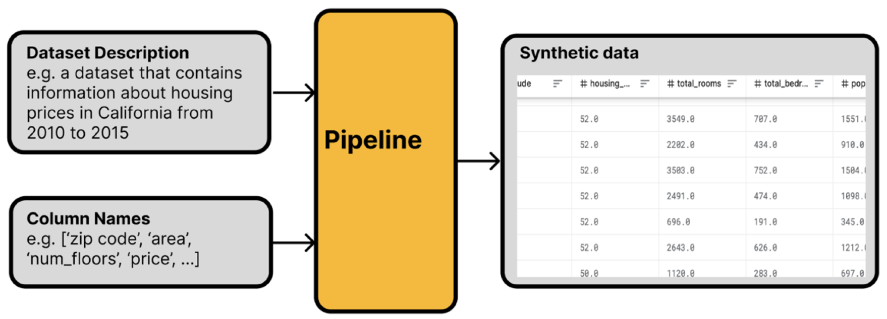
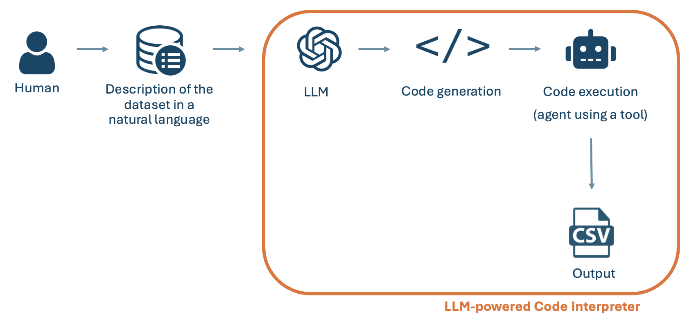
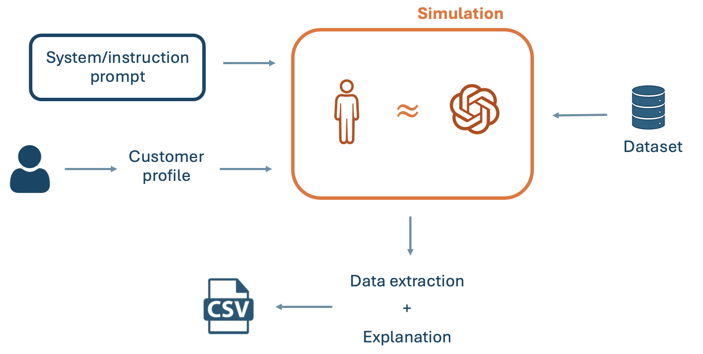
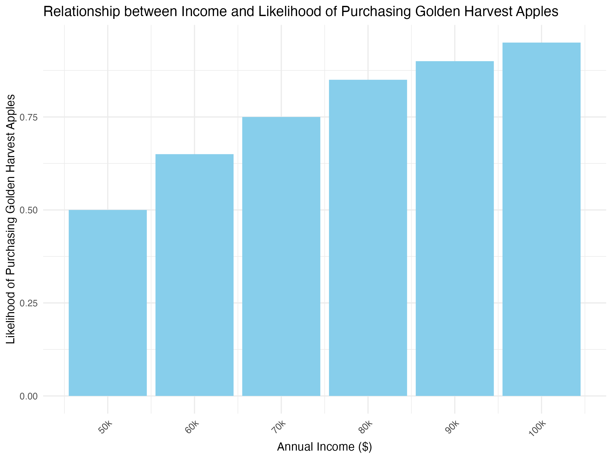
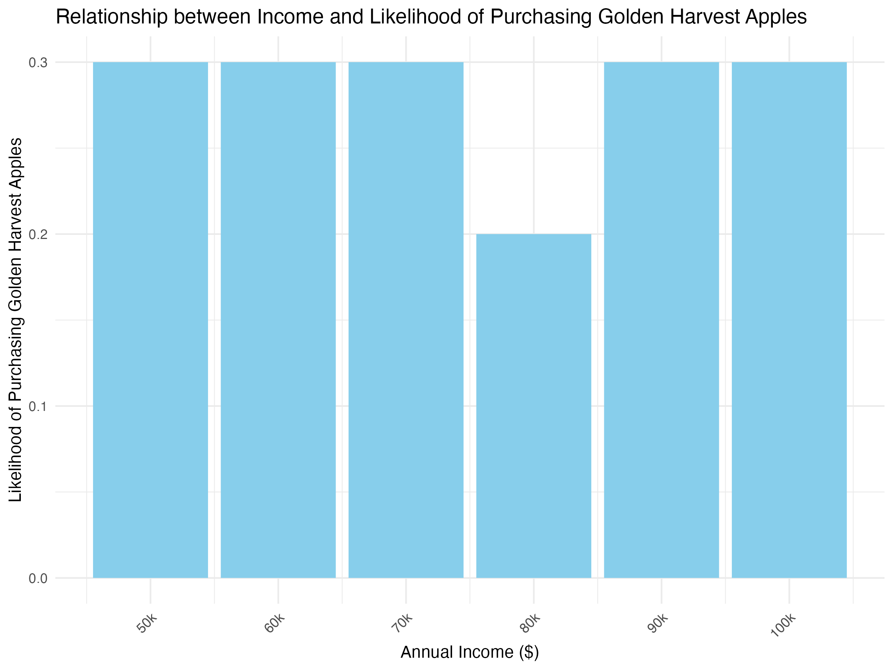
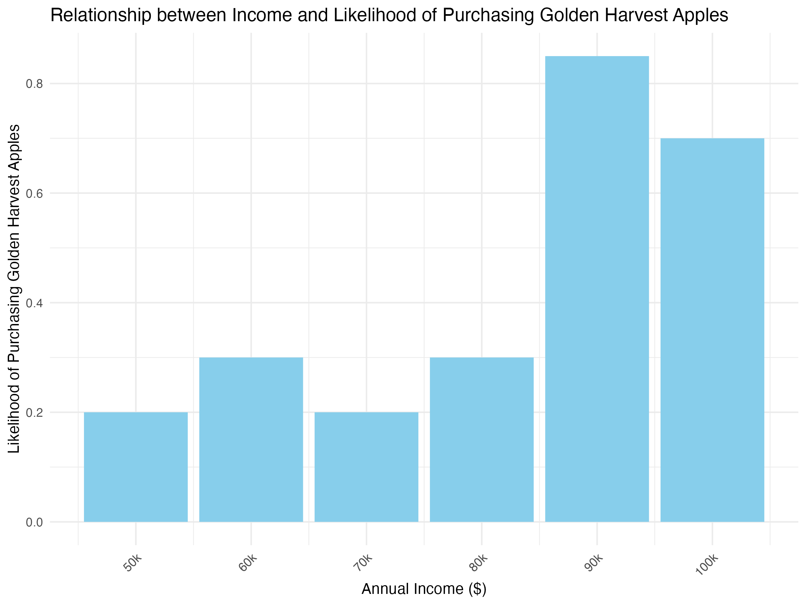
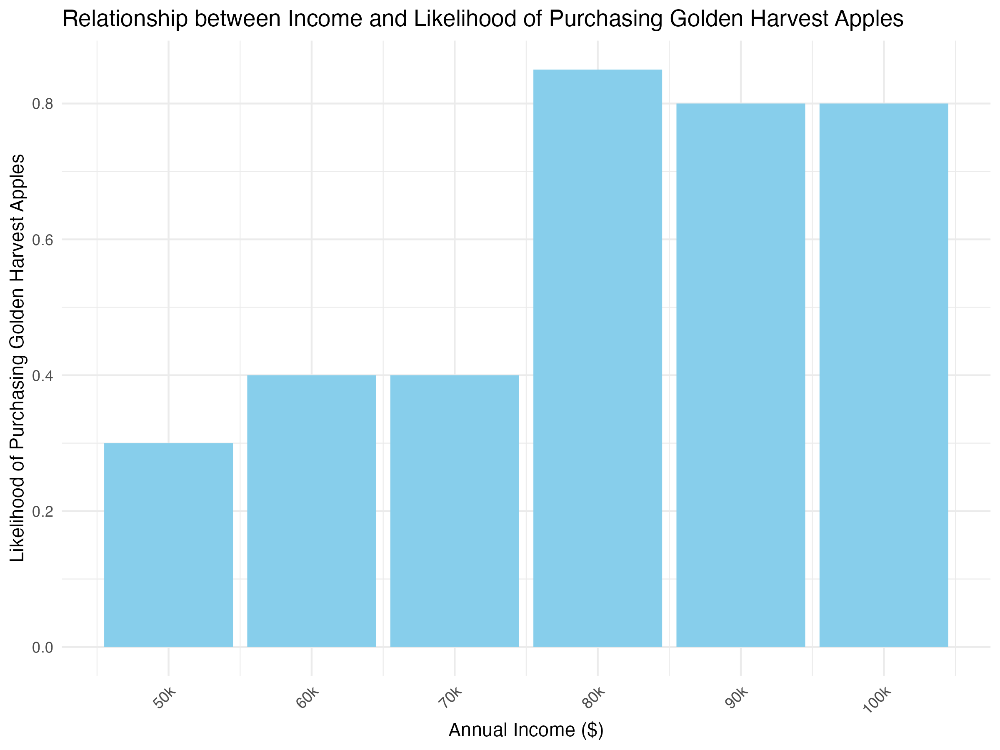

# Introduction

While in the first part of the project we trained from scratch a language model to generate synthetic data, now we focuse on pre-trained models. How the massive knowledge of a pre-trained model like GPT 4 can be useful when generating synthetic datasets? Actually, if our goal is to replicate the same distribution from an original dataset to produce a synthetic counterpart, that massive knowledge is unnecessary since we don't need any additional information other than the one contained in the original data. Suppose now that we want to generate a dadataset simply giving a natural language description of it, even if the model isn't trained on the data we want to produce. This is the idea discussed in the first part of the article, where we review a work called _Universal Tabular Data Generator with LLM_. The idea of this work is interesting, but lacks of an important explanation: how the model generate a particular value? To investigate more this problem, instead of producing directly a tabular dataset, we use the most powerful GPT model avaible today to perform controlled simulations. Collecting all the data after these simulations allows us not only to observe the results, but also the "reasoning" of the model that produced them.   

# 1. Review of [Universal Tabular Data Generator with LLM](https://web.stanford.edu/class/archive/cs/cs224n/cs224n.1234/final-reports/final-report-169369314.pdf)

## Overview
-  The project aims to build a model that can generate synthetic tabular data from a natural language dataset description and column metadata, and is able to generate synthetic data on dataset it has never seen before.
  **Example: "incorporating information about Florida housing prices and the cost of living in Florida and California to generate synthetic data on California housing prices".**

 - The author builds a Pipeline to generate the synthetic tabular data given the dataset description and the column names.

   

  

- To preprocess the data we attach to a prompt that consist of the dataset description and the column names some row values from the original dataset as completition. Here is an example from the training dataset: 

```
prompt :
A dataset which contain some customers who are withdrawing their account from the bank due to some loss
and other issues with the help this data we try to analyse and maintain accuracy. The following data is in a csv
format. The columns of this dataset includes
RowNumber,CustomerId,Surname,CreditScore,Geography,Gender,Age,Tenure,Balance,NumOfProducts,Has
CrCard,IsActiveMember,EstimatedSalary,Exited
-------------
RowNumber,CustomerId,Surname,CreditScore,Geography,Gender,Age,Tenure,Balance,NumOfProducts,Has
CrCard,IsActiveMember,EstimatedSalary,Exited
completion :
1,15634602,Hargrave,619,France,Female,42,2,0,1,1,1,101348.88,1
2,15647311,Hill,608,Spain,Female,41,1,83807.86,1,0,1,112542.58,0
3,15619304,Onio,502,France,Female,42,8,159660.8,3,1,0,113931.57,1
```

*In this example there are three rows: this is a parameter we can tune and we call it window.*

- Then a pre-trained GPT-3 babbage model is finetuned.

- At the generation stage the model is recurrently called and the generated rows are extracted unitl the required number of rows is reached. 

- *"Even though the performance is not high, it is performing significantly better than random, showing that the overall approach of generalizing
synthetic data generation from multiple datasets is working".*

## Why it's interesting

- It generates *unseen* dataset, and potentially a larger model finetuned on more datasets could reach better performance.

## Critical observations

- GPTs models are pretrained on very large scale of data, possibly including datasets or related text to datasets. We can't assure that the model has never seen a particular dataset during training if it's pretrained on a very large scale of data taken from the web.

- The author didn't take many tests to validate his work: we have only one observation from the results, we can't predict how this model performs with other datasets.

- The author doesn't try to generate the same dataset varying the datasets for the finetuning: if all of this make sense, modifying the given dataset should lead to different synthetic data distribution. In other words, by changing the information given during the finetuning, I can test if that same information is used during inference. We will further discuss this argument in the next part of the article.

- It's not clear how this approach could be applied in real case scenarios. Instead of generating a dataset as the author explains, we propose to use a similar approach to generate simulations given not only data, but also a description of the enviroment (**prompt-based conditional text generation**).


We propose two alternatives to the pipeline showed before: one involving code tools (Part 2: Alternative framework for universal tabular data generator) , the other one leveraging on the capacity of LLMs to generate realistic simulations (Part 3: Pre-trained LLMs as simulations generator).

# 2. Tabular Data Generation with coding tool

We propose a very simple framework to generate tabular datasets given a natural language description. In this case is not necessary to finetune the model but we leverage on tool calls by an agentic LLM.



- The user provide a natural language description of the dataset it wants to generate, for example:

```
Generate a dataset containing the articles of a small grocery shop with their prices and a short description of the article.
The grocery shop offers multiple brands for each product.
```
Dataset description can include correlation between variable and other informations.
- What happens next is that the LLMs generate the code to sample the data according to the given description.
- Using a tool, the code is executed. 
- The generated data are stored in a csv file that can be downloaded by the user.

This simple but yet effective approach is desiderable when we want to generate a dataset with specific conditions, for example we want to test a machine learning model. 
With this same method we generated the table of the grocery shop that you can see in the next chapter.

# 3. Pre-trained LLMs as simulations generator
## Some useful background

**Reference:**

**[Kenneth Li, "Do Large Language Models learn world models or just surface statistics?", The Gradient, 2023.](https://thegradient.pub/othello/)**

**[George Gui and Olivier Toubia, "The Challenge of Using LLMs to Simulate Human Behavior: A Causal Inference Perspective"](https://arxiv.org/pdf/2312.15524)**

**[Lisa P. Argyle et al.,"Out of One, Many: Using Language Models to Simulate Human Samples"](https://arxiv.org/abs/2209.06899)**

If we want to use a LLM to generate data of unseen distribution, we have to understand how the model generates those data: does it simply imitates some _surface statistics_ or it infers them from an internal representation of the world, in other words a world model. If the first hypothesis is true, then generating unseen data doesn't make sense since they are in truth reflecting some seen data. If the second one instead is true, then we can generate  simulations and with realistic causal effects: **the better the representation inside the model is, the more realistic the simulations will be**. 
To explore this question better we suggest the referenced article by Kennet Li.

We then suggest the reading of another work by George Gui and Oliver Toubia, who investigate how to generate realistic simulations of human behavior and showing how challenging it is. In fact, we faced the same problems in our simulations. 

Another work we encourage to read is the third one we referenced above. They state that "_by selecting a conditioning context that evokes the shared socio-cultural experience of a specific demographic group, we find that it is **possible to produce response distributions that strongly correlate with the distribution of human responses to survey questions from that demographic**_" and "_given basic human demographic background information, **the model exhibits underlying patterns between concepts, ideas, and attitudes that mirror those recorded from humans** with matching backgrounds_". 

## Simulations generator
We propose a different approach to synthetic data generation: we give the model a representation of an enviroment, then ask the LLM to produce a simulation given particular conditions. The system/instruction prompt is useful to generate multiple simulations since it remains costant amd can be defined once.  We can perform as many simulation as we need, then we can collect all the data we need and store them in a new csv file.



The representation of an enviroment can be a natural language description of it, with the addition of a dataset containing some informations we need. The system/instruction prompt isn't strictly necessary, but it's useful when we want to perform multiple simulations and since it remains costant it can be defined only once. With the next example it will be more clear.

### Grocery shop simulation
This simple experiment is performed to study the capacity of LLMs to generate **realistic simulations of human behavior** in a small and controlled enviroment. In this case we're not even interested in generating a final tabular dataset, we will just focus on the simulation part (that is actually the core of our work and requires more effort).

We want to simulate a 40 years old woman going to a grocery shop. In a csv file are collected all the articles and relative prices that are on sale.

| Article   |   Price ($) | Description                         | Brand            |
|:----------|------------:|:------------------------------------|:-----------------|
| Apple     |        1.29 | Fresh and crispy red apples         | Nature's Delight |
| Detergent |        2.42 | Effective and fragrant detergent    | Gain             |
| Grapes    |        5.75 | Juicy and sweet seedless grapes     | Green Giant      |
| Juice     |        3.23 | Freshly squeezed orange juice       | Simply Orange    |
| Tomatoes  |        3.01 | Vine-ripened tomatoes               | Cherry Delight   |
| Carrot    |        1.27 | Organic carrots, perfect for salads | Organic Valley   |
| Lettuce   |        0.76 | Crisp and fresh lettuce             | Romaine Garden   |
| Pasta     |        1.82 | Durum wheat pasta                   | Barilla          |
| Ice Cream |        1.40 | Creamy vanilla ice cream            | Breyers          |
| Quinoa    |        5.56 | High-protein quinoa, 500g           | Ancient Harvest  |

[Full table](https://github.com/annalisapaladino/Universal-Tabular-Data-Generator/blob/main/datasets/no-timeseries/Grocery_Shop_Articles_with_Multiple_Brands.csv)

For this simple simulation we use [ChatGPT 4o](https://openai.com/index/hello-gpt-4o/) since is both powerful and free. Further experiments should be done with API calls to a GPT endpoint to control more parameters like the temperature.

1. We upload the csv table of the grocery shop
2. We use the following **conditioning prompt**: ```This csv contains all the merch in a grocery shop. You have to generate a simulation: simulate a 40 years old woman, mum of three children (age between 5 and 13) who goes to the grocery shop to buy all the necessary for the weekend. She works as a nursery, her husband is a lawyer. Generate, for each product in the csv list, how likely she buy the article. ```

The model output contains also the reasoning behind the generated likelihoods: 

```
To simulate the likelihood of a 40-year-old woman, a mother of three children, buying each article from the grocery shop, I will take into account several factors such as:


- Household Composition: Three children aged between 5 and 13.
- Occupation: The woman works as a nursery nurse and her husband is a lawyer.
- Weekend Necessities: The likelihood will be influenced by the need to provide meals and snacks for the family, including healthy options for the children.
I'll use a scoring system based on these factors to estimate the likelihood. Here's the basic approach:

- Essentials for Children: Items like fruits, dairy products, snacks, and breakfast cereals will have higher likelihood scores.
- Essentials for Family Meals: Items for main meals (meat, vegetables, pasta, rice, etc.) will have moderate to high scores.
- Convenience Items: Items that save time for a busy working mother may have moderate scores.
- Luxury/Non-essential Items: Items that are less essential or luxury items may have lower scores. 
- Household Composition: Three children aged between 5 and 13.
- Occupation: The woman works as a nursery nurse and her husband is a lawyer.
- Weekend Necessities: The likelihood will be influenced by the need to provide meals and snacks for the family, including healthy options for the children.
I'll use a scoring system based on these factors to estimate the likelihood. Here's the basic approach:

- Essentials for Children: Items like fruits, dairy products, snacks, and breakfast cereals will have higher likelihood scores.
- Essentials for Family Meals: Items for main meals (meat, vegetables, pasta, rice, etc.) will have moderate to high scores.
- Convenience Items: Items that save time for a busy working mother may have moderate scores.
- Luxury/Non-essential Items: Items that are less essential or luxury items may have lower scores.
 ```

[Full Likelihood Table](https://github.com/annalisapaladino/Universal-Tabular-Data-Generator/blob/main/datasets/no-timeseries/Grocery_Shop_Articles_Likelihood.csv)

In this simple example, we showed how GPT is capable of producing realistic simulations (still not perfect in this case, because the same articles but with different prices have same likelihood, but it's something easily adjustable with some prompt tuning). The key point here is that the model gives a **causal reasoning** behind the generation of the likelihood: having three childs leads to healty options, working as a nursery nurse leads to convenience items (*Items that save time for a busy working mother*).
What we have to study now is:

  1. **How the likelihood scores change varying the prompt** (ex. changing the work of the woman or her income)
  2. **How the likelihood scores change varying the data in the table** (ex. changing the prices)
  3. **How to assess the quality of a simulation** (ex. [comparing the overall price elasticity with the one documented in the existing literature](https://arxiv.org/pdf/2312.15524))

Let's discuss both points.

## How the likelihood scores change varying the prompt

To test how the model chooses the likelihood value, we change the value of the family income and see how the model adapt its generation. In particular, this is the instruction promot we used:

```

The uploaded csv contains all the merch in a grocery shop.
You have to generate a simulation: simulate a 40 years old woman, mum of three 
children (age between 5 and 13) who goes to the grocery shop to buy all the 
necessary for the weekend. She works as a nursery, her husband is a lawyer. 
The user will tell you the annual income of the woman's family, then you will 
tell how likely you will buy the golden harvest apple. Your response will be:
"likelihood = {value}, explanation: {text}

```

We ask to provide not only the likelihood value, but also an explanation: it's important to understand why the model comes with that value and how the model is "reasoning". All the explanations are in the full report.
Let's see just an example:

```
With an annual income of $100,000, 
the family has substantial financial flexibility to invest in high-quality and 
nutritious groceries. The strong emphasis on providing the best nutrition for 
their children, combined with a stable and high income, makes it very likely 
they will regularly purchase the more expensive Golden Harvest apples. The 
significant financial comfort allows them to prioritize quality without compromising 
their budget.
```
We can observe some implict correlations, like the fact that a more expensive apple has higher quality and it's a better nutrition for the children. Also we didn't tell in the prompt if an income of 100k is high or not, but he recognize that it's a *significant financial comfort*. 

We expect that increasing the annual income, also the likelihood will increase.




It's important to notice when the generation of each value is independent from the previous ones or not. In this case they're dependent: chatGPT save the chat history, so it consider previous given values of the likelihood (**carryover effect**). To obtain independent results, after each generation we clear the chat history. 
We observe less sensitive results in respect to the changes of income.




If we take larger values of income, we finally observe some variations:

- income: 150k, likelihood: 0.75
- income: 1.000k, likelihood 0.90

Anyway, this represent a problem: we want to make independent simulations, but the results are not satisfactory. Now let's add an information to the prompt: ``` The median annual income of a family in US is around 75.000$. ```
The results now are significantly different.





From this experiment we learned that, in order to obtain independent and realistic simulations, changing the parameters is generally not enought, we need to add some informations. We can expect that **adding more informations to the prompt, the model will adapt its internal representation and capture the world dynamics better**. In this example, adding the median annual income force the model to compare the family income with the US median, in other words the model changed the generation dynamics.

## How the likelihood scores change varying the data in the table

We modify the prices of the apples: the _Golden Harvest_ aren't the most expensive anymore, and we expect that this change in the price will be reflected in the simulation. 


| Article | Price ($) | Description                   | Brand            |
|---------|-----------|-------------------------------|------------------|
| Apple   | 3.54      | Fresh and crispy red apples   | Golden Harvest   |
| Apple   | 3.12      | Fresh and crispy red apples   | Orchard Fresh    |
| Apple   | 3.70      | Fresh and crispy red apples   | Nature's Delight |




We observe a slightly higher likelihood for the lower income values due to the fact that now the price comparison with the other brands is more fair. 


## How to assess the quality of a simulation

To assess the quality of a simulation doesn't exist a general criteria since it strongly depends on our study domain. It's important to notice that the metrics we will introduce are related to the field of social sciences. 
What we propose next are qualitative approaches to validate our language model and the results. 

### Algorithmic Fidelity

Before starting to generate synthethic data we need to choose a proper LLM. We suggest to decide which criteria have to be satisfied based on the work aim and then test the model.

In the paper *["Out of One, Many: Using Language Models to Simulate Human Samples" by Lisa P. Argyle et al.,](https://arxiv.org/abs/2209.06899)* the authors ask themselves how much confidence to have in the ability of the model to generate good simulations. They introduce the _algorithmic fidelity_ 
as _"the degree to which the complex patterns of relationships between ideas, attitudes, and socio-cultural contexts within a model accurately mirror those within a range of human sub-populations"_.
They suggest four criteria:

1- **Social Science Turing Test**: generated responses are indistinguishable from parallel human
texts.

2- **Backward Continuity**: Generated responses are consistent with the attitudes and socio-demographic information of its input/“conditioning context” such that humans viewing the responses can infer key elements of that input.

3- **Forward Continuity**: Generated responses proceed naturally from the conditioning context provided, reliably reflecting the form, tone, and content of the context. 

4- **Pattern Correspondence**: Generated responses reflect underlying patterns of relationships between ideas, demographics, and behavior that would be observed in comparable human-produced data.

_" A lack of fidelity in any one of these four areas"_, they state in the paper, _"decreases confidence in its usability; a lack of fidelity in more than one decreases confidence further"_. 

Those criteria are related to the generation of realistic answers to surveys and investigations, because that is the aim of their paper. In the grocery shop example we proposed instead we're intereseted in simulating human behavior. Beacause of that we readapt those criteria:

1- The explanation given by the LLM about the generated likelihood value is **comprehensible and reasonable, in a human friendly language**.

2- Generated **simulations** are consistent with the attitudes and socio-demographic information of its input/“conditioning context” such that humans viewing the **results** can infer key elements of that input. 
-_In our example, we studied how changing the income influenced the output of the model_.-

(3- This criteria doesn't relate to our scope at all, we simply skip it.)

4- Generated **simulations** reflect underlying patterns of relationships between ideas, demographics, and behavior that would be observed in comparable human-produced data.


### Silicon Sampling Methodology

In the grocery shop example we described a particular customer, inserting details like age, genre, income ecc. In fact, we provided the model a precise profile of the customer to simulate, something similar to what authors in *["Out of One, Many: Using Language Models to Simulate Human Samples" by Lisa P. Argyle et al.,](https://arxiv.org/abs/2209.06899)* call **silicon sampling**. They added real backstories to the prompt in order to produce more realistic answers, conditioning the model generation. In our case, we didn't add backstories but we described the conditions of a customer, like having a particular job, a family income ecc. 


# 4. Probabilistic Interpretation of Using LLMs for Behavior Simulation

From a probabilistic point of view, Large Language Models (LLMs) such as GPT-4 can be interpreted as complex systems that model the conditional probability distribution over sequences of tokens. This allows them to generate contextually relevant text given a certain input context. Here, we explore how LLMs can be used to simulate human behaviors, such as predicting the likelihood of buying a certain product given specific demographic information.

#### 1. **Conditional Probability Distribution**

Formally, an LLM models the probability distribution:

$$p(x_n \mid x_1, x_2, \ldots, x_{n-1})$$

where $x_1, x_2, \ldots, x_{n-1}$ are the preceding tokens (context), and $x_n$ is the next token to be generated.

#### 2. **Context Conditioning**

When simulating human behaviors, the context provided to the LLM includes detailed demographic information. For instance, if we want to simulate the behavior of a woman of a certain age and occupation, this information is encoded into the input prompt. This process can be seen as conditioning the probability distribution:

$$p(\text{behavior} \mid \text{context})$$

where "behavior" represents actions such as purchasing a product, and "context" includes demographic details like age, occupation, and other relevant factors.

#### 3. **Bayesian Inference and Updating Beliefs**

The process of providing context to the LLM is analogous to Bayesian inference, where prior beliefs (the model’s pre-trained knowledge) are updated based on new evidence (the input prompt). The LLM updates its internal probability distribution to generate outputs that are consistent with the given context. The formal relationship can be expressed as:

$$p(x_n \mid x_1, x_2, \ldots, x_{n-1}, \text{context})$$

Here, the context influences the conditional probabilities, guiding the model to generate behavior predictions aligned with the demographic information.

#### 4. **Modeling Human Behavior**

To simulate human behavior such as purchasing decisions, we construct prompts that include demographic details. The LLM generates sequences of tokens representing actions, which can be interpreted probabilistically.

For example, let’s consider the prompt:

"_Simulate a shopping trip for a 35-year-old woman who works as a teacher and has three children. Describe her journey through the supermarket and the items she buys._"

The LLM uses this context to sample from the probability distribution:

$$p(\text{item}_k \mid \text{context})$$

where $\text{item}_k$ is a potential product that the woman might buy. The LLM generates a sequence of purchases that probabilistically aligns with the given context.

#### 5. **Marginal and Joint Probabilities**

The likelihood of purchasing a specific product can be interpreted using marginal and joint probabilities. If we are interested in the probability of buying a product $P$:

$$p(P \mid \text{context})$$

This can be further decomposed if we consider multiple products or actions in sequence:

$$p(P_1, P_2, \ldots, P_k \mid \text{context}) = p(P_1 \mid \text{context}) \cdot p(P_2 \mid P_1, \text{context}) \cdot \ldots \cdot p(P_k \mid P_1, P_2, \ldots, P_{k-1}, \text{context})$$

The LLM implicitly models these joint probabilities through its sequential token generation process.

# Example Table

Here there is a full example of a synthetic table generated with our framework:

| Gender | Age | Income  | Profile                                                                                                   | Weekly Expense | Explanation                                                                                                                                                                                                                                                                                                |
|--------|-----|---------|-----------------------------------------------------------------------------------------------------------|----------------|------------------------------------------------------------------------------------------------------------------------------------------------------------------------------------------------------------------------------------------------------------------------------------------------------------|
| F      | 50  | 80,000$ | A 50 years old single mum of a 7 years old child                                                          | $118.22        | Based on the provided data and the typical weekly shopping list for a 50-year-old single mother of a 7-year-old child, the estimated weekly grocery expense is $118.22. This estimate includes a balanced mix of fruits, vegetables, dairy, proteins, grains, snacks, beverages, and household items, reflecting a moderate to high grocery budget suitable for her income level. |
| F      | 23  | 50,000$ | Student of a Data Science & Artificial Intelligence Master that is vegetarian                             | $83.09         | The calculation is based on the average prices of essential vegetarian items that a 23-year-old female student pursuing a Data Science & Artificial Intelligence Master's degree would likely purchase for a week. These items include fruits, vegetables, grains, dairy alternatives, and snacks. The average prices of available items were used to estimate the total weekly expense.  |
| M      | 85  | 70,000$ | Recently widower that has no child or nephew                                                              | $61.82         | Based on the provided profile (an 85-year-old male, recently widowed with an income of $70,000 and no children or nephews), the estimated weekly expense for groceries is approximately $61.82. This estimate includes a variety of essential items such as fruits, vegetables, bread, dairy products, meats, grains, personal care items, and cleaning supplies. The quantities were chosen to reflect a reasonable amount for one person for a week, focusing on ease of preparation and essential needs. |
| M      | 32  | 70,000$ | Young man working for a bank that likes to eat fit and goes to the gym 5 times a week                      | $87.66         | For a young man working in a bank who likes to eat fit and goes to the gym 5 times a week, the weekly grocery expense was calculated based on the following typical healthy food choices: Fruits, Vegetables, Lean Proteins, Healthy Fats, Whole Grains, Dairy or Alternatives, Supplements. The total estimated weekly expense for these items is $87.66.                                           |
| F      | 64  | 90,000$ | Married woman and mother of two girls that are 13 and 17                                                  | $172.74        | Based on the profile provided (64-year-old married woman with an income of $90,000 and two teenage daughters), the estimated weekly expense for groceries is calculated as follows. The grocery list includes a variety of fruits, vegetables, dairy products, and household essentials, with quantities adjusted to meet the weekly needs of the family. Prices were randomly selected from available brands in the dataset for each item, and the total cost was calculated accordingly. |
| M      | 40  | 60,000$ | He works as a policeman and he's single dad of a 5 years old boy                                          | $120.13        | Based on the typical grocery list for a single dad with a young child, the estimated weekly expense is calculated as follows: Fruits, Dairy, Proteins, Staples, Beverages, Vegetables, Snacks, Household Items. The total expense of $120.13 per week reflects a moderate spending pattern suitable for their needs and income.                              |
| F      | 35  | 100,000$| She is the CEO of an assurance and has no husband and children moreover she usually works extra hours and goes back home late | $185.50        | Pre-made meals (7 meals/week): $10 per meal * 7 meals = $70, Breakfast items (7 items/week): $5 per item * 7 items = $35, Snacks (14 items/week): $3 per item * 14 items = $42, Coffee/tea (14 servings/week): $2 per serving * 14 servings = $28, Beverages (7 bottles/week): $1.5 per bottle * 7 bottles = $10.50. Given her busy lifestyle, she spends approximately $185.50 per week on groceries. |
| M      | 45  | 80,000$ | He is a teacher and father of 3 children (7, 10, 13 years old)                                            | $97.42         | Based on the given profile, the estimated weekly expenditure for a family of four is $97.42. This estimate considers the following categories and typical quantities: Fresh Produce, Protein Sources, Staples, Snacks and Beverages, Household Essentials. This estimation aims to provide a balanced diet and necessary household items for a week, considering the needs of a family with three children. |
| M      | 20  | Parent's money | He is a student of a business school and he is living in a shared flat with 3 other students             | $90            | This estimate considers the needs of a young male student living in a shared flat. The expenses are balanced between basic food items, snacks, and personal care products, reflecting a typical budget for a student with moderate to low income (supported by parents).                                                                  |
| M      | 23  | Parent's money | He is a student that lives in Trieste with a renting flat with 3 other students, everyday he goes to the gym and he walks a lot to move everywhere so he consumes a lot of food | $70.70         | Based on the student's lifestyle, the estimated weekly expense for groceries includes a balanced diet with a variety of items. This calculation considers high protein intake, essential for gym-goers, and a mix of carbohydrates, fruits, vegetables, snacks, and beverages to support his active lifestyle and high food consumption. The total estimated weekly expense for these groceries is approximately $70.70.  |

## To do

1. We saw that LLMs are great in mirroring human behavior, but we didn't try with other simulation domains like physiscs or chemistry. Further studies should study how good are LLMs in those domains.

2. 
